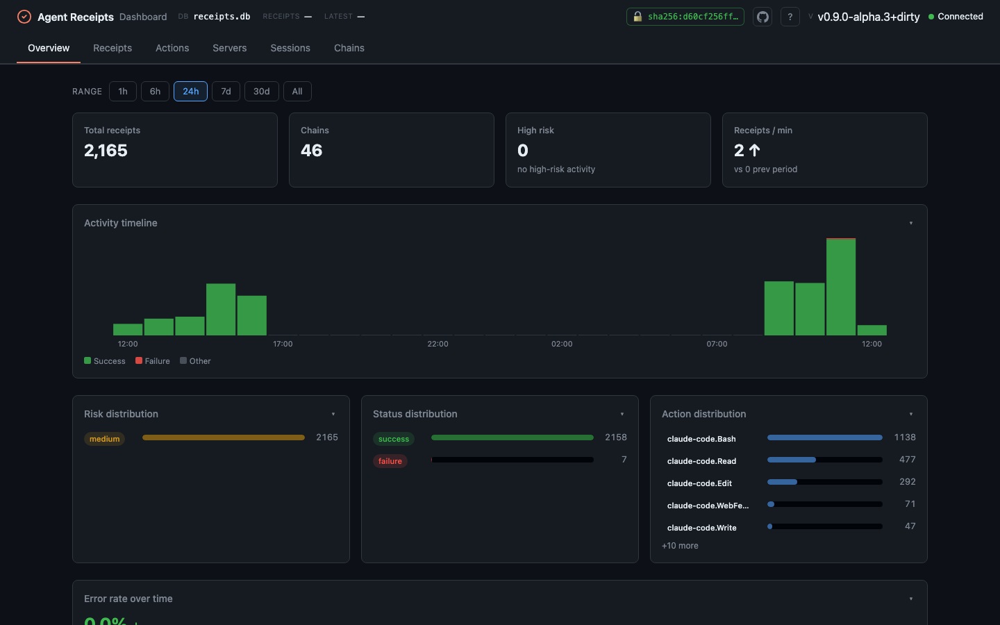
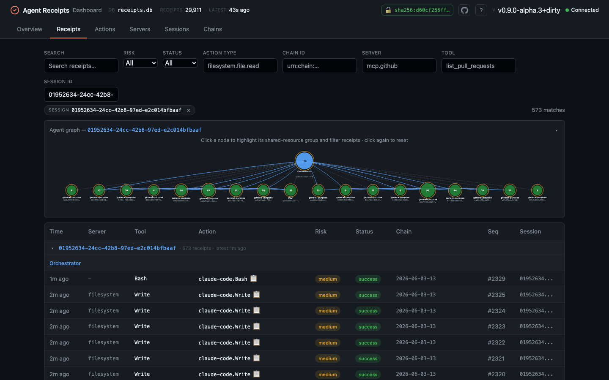
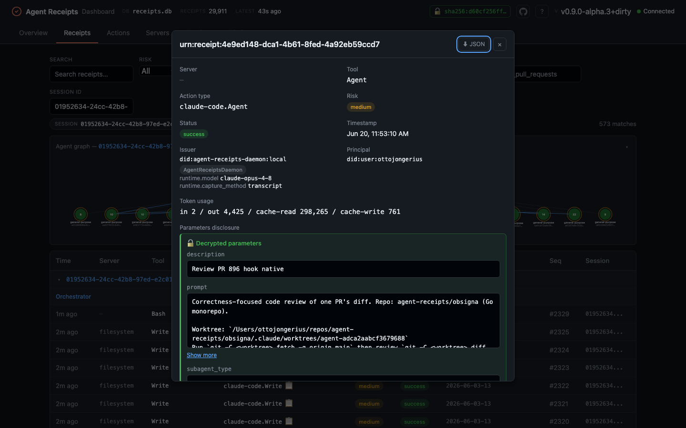

<div align="center">

# Agent Receipts Dashboard

Lightweight local web UI for browsing [Agent Receipts](https://github.com/agent-receipts/obsigna) audit trails. Single Go binary; UI loads htmx and Tailwind from CDNs.

[](https://github.com/agent-receipts/dashboard/actions/workflows/ci.yml)
[](https://github.com/agent-receipts/dashboard/releases/latest)
[](https://go.dev)
[](LICENSE)

</div>



## What is this?

[Agent Receipts](https://github.com/agent-receipts/obsigna) is a protocol for cryptographically signed, tamper-evident audit trails produced by AI agents. Every action an agent takes — file writes, API calls, shell commands — is recorded as a receipt: signed, chained, and verifiable.

The dashboard is a read-only local viewer for those receipt databases. Point it at any SQLite database written by an Agent Receipts SDK (Go, TypeScript, Python) or MCP proxy, then browse, filter, and verify your agent's activity in your browser.

## Quick start

**Homebrew** (macOS / Linux):

```sh
brew install agent-receipts/tap/dashboard
dashboard
```

**Pre-built binary** — download from [Releases](https://github.com/agent-receipts/dashboard/releases/latest), make it executable, then run:

```sh
./dashboard
```

**Go install:**

```sh
go install github.com/agent-receipts/dashboard/cmd/dashboard@latest
dashboard
```

**Build from source:**

```sh
git clone https://github.com/agent-receipts/dashboard.git
cd dashboard
make build
./dashboard
```

Opens http://localhost:8080 and reads `~/.local/share/agent-receipts/receipts.db` by default — the same path used by the SDKs and MCP proxy.

## CLI reference

| Flag | Default | Description |
|------|---------|-------------|
| `-db` | `~/.local/share/agent-receipts/receipts.db` | Path to receipts SQLite database |
| `-port` | `8080` | HTTP server port |
| `-host` | `127.0.0.1` | Address to bind (use `0.0.0.0` for all interfaces) |
| `-poll-interval` | `5s` | How often the UI polls for new receipts. Also honoured via `AR_DASHBOARD_POLL_INTERVAL`. |
| `-forensic-key-dirs` | _(home dir)_ | Comma-separated list of extra absolute directories from which the forensic key path endpoint (`POST /api/forensic-key/path`) may load a key. The user's home directory is always allowed. Non-absolute entries are silently skipped. |
| `-version`, `--version` | | Print the version and exit |
| `-h`, `--help` | | Print usage and exit |

```sh
# Reads ~/.local/share/agent-receipts/receipts.db by default
dashboard

# Custom database
dashboard -db ./my-receipts.db

# Custom port and bind address
dashboard -host 0.0.0.0 -port 9090

# Slower live polling (env var also works: AR_DASHBOARD_POLL_INTERVAL=10s)
dashboard -poll-interval 10s

# Print version, then exit
dashboard --version
```

## Features

- **Live updates** — new receipts stream into the list without a manual refresh; polling pauses when the tab is hidden
- **Read-only** — opens the SQLite database in read-only mode and never modifies your data
- **Universal** — reads databases produced by any Agent Receipts SDK (Go, TypeScript, Python) or MCP proxy
- **Filter** — narrow receipts by action type, risk level, status, time range, and chain ID
- **Session attribution** — for multi-agent sessions, visualises delegation structure, cross-agent file dependencies, blast-radius, and risk rings (see below)
- **Chain verification** — validates hash linkage, sequence ordering, and (with a public key) Ed25519 signatures for any chain
- **Forensic decryption** — when a forensic key is loaded, decrypts HPKE-encrypted parameter disclosures inline so you can preview the real tool inputs/outputs (loopback-only; see below)
- **Insights & analytics** — activity timeline, error-rate and throughput trends, top actions by failure rate, and a per-server/tool breakdown, all scoped to a time-range picker
- **Detail view** — inspect any receipt with its full raw JSON payload, and export any receipt or whole chain as JSON
- **Dark theme** — risk-level color coding for at-a-glance triage

## Verifying chains

Verify any chain from the **Verify** control in the UI, or via the API:

- **Structural** (no key) — recomputes each receipt's canonical hash from the verbatim bytes stored in the database and checks hash linkage and sequence ordering. A green result means the chain links and is correctly ordered; signatures are not checked.
- **Full** (with a public key) — additionally verifies each receipt's Ed25519 signature. Paste the daemon's PEM public key into the textarea beside the Verify button, or pass it as `?public_key=<PEM>` to `GET /api/chains/{chainID}/verify`. Each receipt carries a `signature_valid` field, shown as a Sig ✓/✗ badge.

Verification recomputes from the verbatim `receipt_json` bytes, so a chain that `obsigna receipt verify` accepts verifies here too.

## Forensic decryption

If your receipts carry HPKE-encrypted parameter disclosures (the daemon's parameter-disclosure mode, `--forensic-public-key`), the dashboard can decrypt them inline so you can preview the real tool inputs and outputs — without the key ever leaving the machine.

- **Auto-load** — on startup, if the dashboard is bound to a loopback address and a key exists at the default path `~/.local/share/agent-receipts/forensic.key`, it is loaded automatically and previews are decrypted on the fly.
- **Manual load** — the UI pre-fills the default path; point it at another absolute path, or paste a key. Accepted formats: raw 32-byte, hex, base64, or PKCS#8 PEM X25519 private key.
- **Fingerprint & mismatch** — the loaded key's `sha256:` fingerprint is shown; receipts encrypted to a different key surface a "key mismatch" state rather than failing silently.

Forensic key operations are **loopback-only** by design — see [Security model](#security-model).

## Insights & analytics

The **Overview**, **Actions**, and **Servers** views turn a store into operational signal, scoped by a time-range picker (`1h · 6h · 24h · 7d · 30d · All`):

- **Activity timeline** — stacked success/failure/other receipts per time bucket
- **Error-rate sparkline** and **throughput** ("receipts / hr" or "/ min") with trend arrows
- **Top actions by failure rate** (Actions tab) and a **per-server/tool breakdown** with mini failure-rate bars
- **Free-text search** plus server/tool/session filters on the Receipts tab, with deep-linkable URLs (`?q=`, `?session_id=`)

## Session attribution

When a session involves multiple agents, the dashboard builds a provable dependency graph from `action.target.resource` paths in the receipts (requires obsigna hook v0.19.0+).



**What you see:**

- **Delegation edges** (dashed gray) — which agent spawned which
- **State-dependency edges** (solid blue arrows) — two agents touched the same file; the arrow points from the agent that acted first to the one that acted after, making the causal order provable
- **Risk rings** — orange (medium) or red (critical) outer rings on nodes with elevated-risk receipts
- **Blast-radius panel** — click any node to see which files it touched, which other agents share a state dependency on those files, and a heuristic co-turn coupling count when agents operated on the same resource in overlapping time windows



**Coverage fraction** — a `N / M receipts identity-indexed` indicator shows how complete the picture is. Receipts without a `target.resource` (Bash, MCP, spawn) are counted but cannot contribute to file-identity edges. A `⚠ mv ops` warning appears when move or rename operations are detected, because path strings may not reliably identify file versions across renames.

The attribution data is served by `GET /api/sessions/{sessionID}/attribution`.

## HTTP API

Everything the UI shows is served by a small JSON API on the same loopback port. Read endpoints:

| Endpoint | Description |
|----------|-------------|
| `GET /api/health` | Liveness check |
| `GET /api/config` | Server config (db path, forensic availability) |
| `GET /api/stats` | Summary stats; accepts `after`/`before` time-window params |
| `GET /api/stats/timeseries` | Bucketed activity counts for the timeline |
| `GET /api/stats/actions` | Top actions by failure rate |
| `GET /api/stats/servers` | Per-server/tool breakdown (optional `?range=`) |
| `GET /api/sessions` | All agent sessions (optional `?range=`) |
| `GET /api/sessions/{sessionID}/attribution` | Full attribution / blast-radius payload |
| `GET /api/receipts` | Receipts, filterable (`?q=`, `?session_id=`, `?limit=N`, …) |
| `GET /api/receipts/{id}` | One receipt's raw JSON |
| `GET /api/chains` | Chains in the store |
| `GET /api/chains/{chainID}/verify` | Verify a chain; `?public_key=<PEM>` adds signature checks |

Forensic endpoints (loopback-only — see [Security model](#security-model)):

| Endpoint | Description |
|----------|-------------|
| `GET /api/forensic-key` | Current key state (loaded?, fingerprint) |
| `POST /api/forensic-key` | Load a key from the request body |
| `POST /api/forensic-key/path` | Load a key from an absolute server-side path |
| `DELETE /api/forensic-key` | Clear the loaded key |
| `GET /api/disclosure/{id}` | Decrypt one receipt's parameter disclosure |

## Security model

The dashboard is **read-only** and binds to **`127.0.0.1` by default**. Forensic decryption — the only feature that touches key material — is deliberately constrained:

- **Loopback-only** — forensic-key and disclosure endpoints return `403` unless the server is bound to a loopback address. Running with `-host 0.0.0.0` disables forensic decryption.
- **Host-header validation** — requests whose `Host` header does not name loopback are rejected, blocking DNS-rebinding attacks where a remote page points its own domain at `127.0.0.1`.
- **CSRF guard** — forensic `POST` endpoints require `Content-Type: application/json`, closing the same-browser cross-origin gap the loopback and Host-header guards don't cover.
- **Path allowlist** — the key path endpoint (`POST /api/forensic-key/path`) only reads files inside the user's home directory or directories explicitly listed via `-forensic-key-dirs`. Paths outside every allowed root return `403 Forbidden`. Paths containing `..` or NUL bytes are rejected before any filesystem access.
- The private key stays in the dashboard process; decrypted snippets are cached only in the browser tab and cleared when the key state changes.

## Project structure

| Path | Description |
|------|-------------|
| `cmd/dashboard/` | CLI entry point and flag parsing |
| `internal/server/` | HTTP server, routes, and handlers |
| `internal/server/static/` | Embedded HTML with htmx + Tailwind (no build step) |
| `internal/store/` | Read-only SQLite access, queries, and filters |
| `internal/verify/` | Hash linkage and chain verification |

## Development

**Requirements:** Go 1.26+ (no CGO — SQLite driver is pure Go).

| Command | Description |
|---------|-------------|
| `make build` | Build the binary |
| `make test` | Run all tests |
| `make lint` | Run `go vet` |
| `make run` | Build and run (default database) |
| `make run DB=path/to/receipts.db` | Build and run against a specific database |

Or with the Go toolchain directly:

```sh
go build ./cmd/dashboard   # build
go test ./...              # test
go vet ./...               # lint
```

## Ecosystem

| Project | Description |
|---------|-------------|
| [agentreceipts.ai](https://agentreceipts.ai) | Protocol site — specification and reference |
| [obsigna.dev](https://obsigna.dev) | Tooling docs — SDKs, MCP proxy, hook, and the dashboard |
| [obsigna](https://github.com/agent-receipts/obsigna) | Agent Receipts monorepo — protocol spec, the Go/TypeScript/Python SDKs, the `obsigna-daemon`, and the MCP proxy |
| [obsigna-daemon](https://github.com/agent-receipts/obsigna/tree/main/daemon) | Signing daemon — holds the key, signs and chains receipts, and ships the `obsigna` read/verify CLI |
| [mcp-proxy](https://github.com/agent-receipts/obsigna/tree/main/mcp-proxy) | MCP proxy — records agent activity as receipts transparently |
| [openclaw](https://github.com/agent-receipts/openclaw) | Open-source autonomous personal AI agent |
| [spec](https://github.com/agent-receipts/obsigna/tree/main/spec) | Agent Receipts protocol specification |

## Contributing

Contributions are welcome — see [CONTRIBUTING.md](CONTRIBUTING.md).

For security vulnerabilities, use [GitHub Security Advisories](https://github.com/agent-receipts/dashboard/security/advisories/new) rather than public issues. See [SECURITY.md](SECURITY.md).

## License

Apache 2.0 — see [LICENSE](LICENSE).
